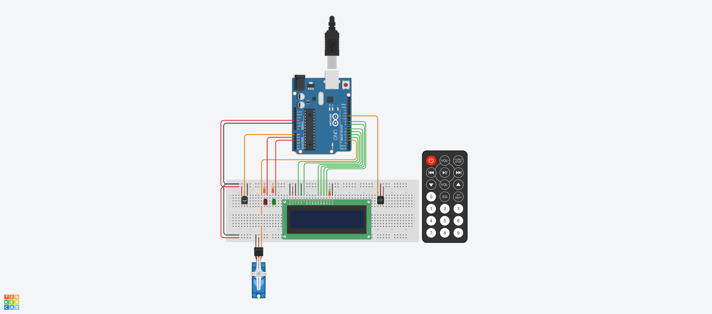
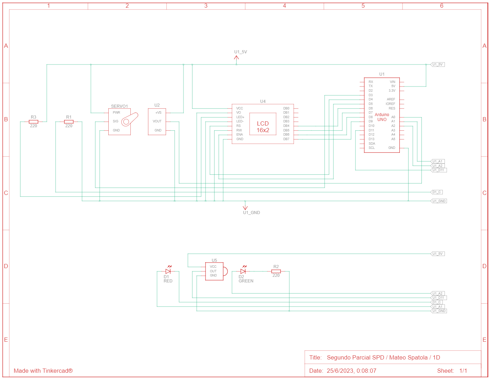

# Segundo Parcial SPD (Parte Práctica Domiciliaria)

## Alumno
- Spatola Mateo

## Proyecto: Sistema de incendio con Arduino.

## Objetivo:
El objetivo de este proyecto es diseñar un sistema de incendio utilizando Arduino que pueda detectar cambios de temperatura y activar un servo motor en caso de detectar un incendio. Además, se mostrará la temperatura actual y la estación del año en un display LCD.

### Componentes necesarios:
- Arduino UNO
- Sensor de temperatura
- Control remoto IR (Infrarrojo)
- Display LCD (16x2 caracteres)
- Servo motor
- Cables y resistencias según sea necesario
- Protoboard para realizar las conexiones
- Dos leds.

### Funcionalidad requerida:
#### Conexiones:
- Conecta el sensor de temperatura al pin analógico A0 de Arduino.
- Conecta el control remoto IR al pin digital 11 de Arduino.
- Conecta el display LCD utilizando los pines correspondientes de Arduino.
- Conecta el servo motor a uno de los pines PWM de Arduino (por ejemplo, pin 9).

#### Control remoto:
- Configura el control remoto IR para recibir señales.
- Define los comandos necesarios para activar y desactivar el sistema de incendio.
- Utiliza un algoritmo para determinar la estación del año (por ejemplo, rangos de temperatura para cada estación).

#### Detección de temperatura:
- Configura el sensor de temperatura y realiza la lectura de la temperatura ambiente.
- Muestra la temperatura actual en el display LCD.

#### Sistema de alarma:
- Define un umbral de temperatura a partir del cual se considera que hay un incendio (por ejemplo, temperatura superior a 60 grados Celsius).
- Cuando se detecta un incendio (temperatura por encima del umbral), se activa el servo motor para simular una respuesta del sistema de incendio.

#### Mensajes en el display LCD:
- Muestra la temperatura actual y la estación del año en el display LCD.
- Cuando se detecta un incendio, muestra un mensaje de alarma en el display LCD.

#### Punto libre:
- Se deberá agregar dos leds y darle una funcionalidad de su elección, acorde al proyecto previamente detallado.

#### Documentación:
- Deberán presentar un diagrama esquemático del circuito y explicar el funcionamiento aplicado de cada componente.
- Presentar el código fuente del proyecto de Arduino listo para ser implementado.
- Deberán explicar el funcionamiento integral utilizando documentación MarkDown.

## Función principal
El codigo hace uso de varias funciones para hacer funcionar el sistema de incendio, el cual esta conformado por un LCD 16x2 (que indica la temperatura actual, la estacion del año y si hay un incendio), por un sensor de temperatura, un servo motor (el cual se activa en caso de detectar un incendio), un control remoto por IR (para encender y apagar el sistema), y por 2 leds que indican si el sistema de incendio se encuentra apagado (led rojo), encendido (led verde) o en alerta de incendio (led rojo titilando).
Las funciones principales son las de detectarSiHayIncendio() y modificarMensajeLCDSegunTemperatura(), ya que estas son las que indican lo que debera hacer el sistema de incendio dependiendo de cual sea la temperatura:

~~~ C (lenguaje en el que esta escrito)
void detectarSiHayIncendio(int temperatura)
{
  if(temperatura >= 60)
  {
    miServo.write(180);
    digitalWrite(LED_ROJO, HIGH);
    delay(200);
    digitalWrite(LED_ROJO, LOW);
    delay(200);
  }
  else
  {
    miServo.write(0);
  }
}
~~~

~~~ C (lenguaje en el que esta escrito)
void modificarMensajeLCDSegunTemperatura(int temperatura)
{
  if(temperatura >= 60)
  {
    mensaje = "HAY UN INCENDIO!";
  } 
  else if(temperatura >= 30 && temperatura < 60)
  {
    mensaje = "Estacion: Verano";
  } 
  else if(temperatura >= 20 && temperatura < 30)
  {
    mensaje = "Estacion: Primavera";
  } 
  else if(temperatura >= 10 && temperatura < 20)
  {
    mensaje = "Estacion: Otoño";
  } 
  else
  {
    mensaje = "Estacion: Invierno";
  }

  LCD.setCursor(0, 0);
  LCD.print("Temperatura: ");
  LCD.print(temperatura);
  LCD.print("  ");

  LCD.setCursor(0, 1);
  LCD.print(mensaje);
}
~~~

## Control Remoto por IR 
Otra funcion importante es la de apagarEncenderConControlRemoto(), ya que gracias a ella el usuario puede encender y apagar el sistema de incendio:
~~~ C (lenguaje en el que esta escrito)
void apagarEncenderConControlRemoto()
{
  if(IrReceiver.decode())
  {
    Serial.print("Boton presionado --> ");
    Serial.println(IrReceiver.decodedIRData.decodedRawData, HEX);
    if(IrReceiver.decodedIRData.decodedRawData == BOTON_ON_OFF)
    { 
      if(flagSistemaEncendido == false)
      {
        Serial.println("Sistema encendido");
        flagSistemaEncendido = true;
      }
      else
      {
        Serial.println("Sistema apagado");
        flagSistemaEncendido = false;
      }
    }
    IrReceiver.resume();
  }
}
~~~

## Leds: verde y rojo
Haciendo uso de las funciones prenderLed(int led) y apagarLed(int led) podemos prender o apagar el led que le pasamos por parametro e imprimirlo por serial:
~~~ C (lenguaje en el que esta escrito)
void prenderLed(int led)
{
  switch(led)
  {
    case LED_VERDE:
    if(flagLedVerdeEncendido == false)
    {
      Serial.println("- Led verde encendido");
      flagLedVerdeEncendido = true;
    }
    break;
    case LED_ROJO:
    if(flagLedRojoEncendido == false)
    {
      Serial.println("- Led rojo encendido");
      flagLedRojoEncendido = true;
    }
    break;
  }
  digitalWrite(led, HIGH);
}
~~~

~~~ C (lenguaje en el que esta escrito)
void apagarLed(int led)
{
  switch(led)
  {
    case LED_VERDE:
    if(flagLedVerdeEncendido == true)
    {
      Serial.println("- Led verde apagado");
      flagLedVerdeEncendido = false;
    }
    break;
    case LED_ROJO:
    if(flagLedRojoEncendido == true)
    {
      Serial.println("- Led rojo apagado");
      flagLedRojoEncendido = false;
    }
  }
  digitalWrite(led, LOW);
}
~~~

## Loop
En el loop principal se hace uso de la funcion apagarEncenderConControlRemoto(), para encender o apagar el sistema de incendio.
Ni bien se inicie el programa, el sistema de incendio se encontrara apagado con el led rojo encendido.

Si el sistema fue encendido, se apagara el led rojo, se encendera el led verde y se activara el sensor de temperatura, para saber la temperatura actual.
Luego, el sistema detectara e imprimira por el LCD la temperatura actual y la estacion del año dependiendo de la temperatura actual.

Si la temperatura es menor a 10°C se indicara que estamos en invierno.
Si la temperatura es mayor o igual a 10°C y menor a 20°C se indicara que estamos en otoño.
Si la temperatura es mayor o igual a 20°C y menor a 30°C se indicara que estamos en primavera.
Si la temperatura es mayor o igual a 30°C y menor a 60°C se indicara que estamos en verano.

Y si la temperatura es mayor o igual a 60°C se indicara que hay un incendio y se hara lo siguiente:
- El LCD indicara la temperatura actual y mostrara una alerta de incendio.
- Se activara el servo motor.
- El led rojo empezara a titilar indicando que hay una emergencia de incendio.

En el caso de que se apague el sistema de incendio, se apagara el led verde, se encendera el led rojo, el servo volvera a su posicion y se borrara el contenido del LCD.

~~~ C (lenguaje en el que esta escrito)
void loop()
{
  apagarEncenderConControlRemoto();
  
  if(flagSistemaEncendido == true)
  {
    prenderLed(LED_VERDE);
    apagarLed(LED_ROJO);
    
    lectura_temperatura = analogRead(TMP);
    temperatura = map(lectura_temperatura, 20, 358,-40,125);
    
    detectarSiHayIncendio(temperatura);
    modificarMensajeLCDSegunTemperatura(temperatura);
  }
  else
  {
    prenderLed(LED_ROJO);
    apagarLed(LED_VERDE);
    miServo.write(0);
    LCD.clear();
  }
}
~~~

## Diagrama esquemático del circuito

### Funcionamiento aplicado de cada componente
#### Sensor de temperatura [TMP36]:
- U2: Terminal GND conectado a GND del Arduino Uno (U1). Terminal VOUT al pin A0 (entrada analogica) del U1. Terminal +VS conectado a 5V del U1.

#### LCD 16 x 2:
U4 Terminales:
- VCC: conectado a 5V del U1.
- VO: conectado a GND del U1.
- LED+: conectado a una resistencia (R3) de 220 ohms y a 5V del U1.
- LED-: conectado a GND del U1.
- RS: conectado al pin D4 (salida digital) del U1.
- RW: conectado a GND del U1.
- ENA: conectado al pin D5 (salida digital) del U1.
- GND: conectado a GND del U1.
- DB4: conectado al pin D6 (salida digital) del U1.
- DB5: conectado al pin D7 (salida digital) del U1.
- DB6: conectado al pin D8 (salida digital) del U1.
- DB7: conectado al pin D9 (salida digital) del U1.

#### Posicional Microservomotor (SERVO1):
- SERVO1: GND tierra conectado a GND del Arduino Uno (U1). Terminal PWR conectado a 5V del U1. Terminal SIG al pin D3 (entrada digital) del U1.

#### Sensor IR:
- U5: Terminal GND conectado a GND del Arduino Uno (U1). Terminal OUT al pin D11 (entrada digital) del U1. Terminal VCC conectado a 5V del U1.

#### Leds:
Los leds son encendidos cuando sus salidas digitales reciben un HIGH o 1 y se apagan cuando reciben un LOW o 0.
- D1 RED: El catodo esta conectado a una resistencia (R1) de 220 ohms y a GND del U1. El anodo esta conectado al pin A1 (salida digital) del U1.
- D2 GREEN: El catodo esta conectado a una resistencia (R2) de 220 ohms y a GND del U1. El anodo esta conectado al pin A2 (salida digital) del U1.

## :robot: Link al proyecto
- [Proyecto](https://www.tinkercad.com/things/2DuQXxBf4hB)
